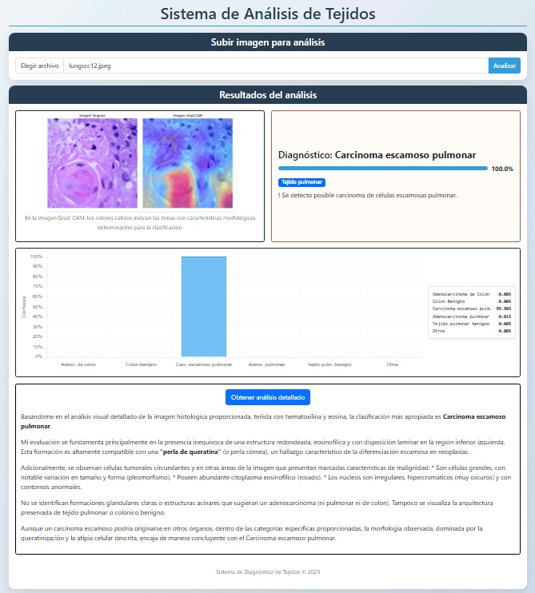

<h1 align="center">Clasificación de Tejidos</h1>

## Descripción
Este proyecto implementa un sistema de clasificación automática de imágenes histopatológicas para la detección y análisis de tejidos pulmonares y colónicos, con enfoque en patrones asociados a cáncer. Utilizando técnicas avanzadas de deep learning, el modelo clasifica las muestras de tejido en categorías específicas, proporcionando información valiosa para asistir en el diagnóstico.

## Funcionalidad 

La versión del sistema ofrece:

- **Clasificación multiclase** en 6 categorías: adenocarcinoma de colon, colon benigno, carcinoma escamoso pulmonar, adenocarcinoma pulmonar, tejido pulmonar benigno y otros
- **Procesamiento de imágenes** mediante un modelo basado en EfficientNet-B3 preentrenado y optimizado para imágenes histopatológicas
- **Interfaz web intuitiva** que permite cargar imágenes fácilmente y visualizar resultados inmediatos
- **Visualización detallada** con gráficos de barras que muestran los porcentajes de confianza para cada categoría
- **Análisis explicativo** mediante IA que proporciona interpretación detallada de las características visibles en el tejido
- **Indicadores de confianza** que alertan cuando la predicción no alcanza un umbral adecuado

<p align="center">
  
</p>

## ✅ Requisitos previos

Antes de comenzar, asegúrate de tener instalados los siguientes programas:

1. **Python 3.8 o superior**  
   - Verifica si ya está instalado con el siguiente comando:
     ```bash
     python --version
     ```
   - Si no lo tienes, descárgalo desde [python.org](https://www.python.org/downloads/) e instálalo. **Recuerda marcar la opción “Add Python to PATH”** durante la instalación.

2. **Git (opcional, pero recomendado para clonar el repositorio)**  
   - Para verificar si está instalado:
     ```bash
     git --version
     ```
   - Si no lo tienes, descárgalo desde [git-scm.com](https://git-scm.com/downloads)

---

## 📥 1. Descargar el Proyecto

Tienes dos opciones para obtener los archivos del proyecto:

### Opción 1: Clonar el Repositorio (Recomendado)
```bash
git clone https://github.com/Saultr21/Clasificacion-de-imagenes-hispatologicas.git
cd Clasificacion-de-imagenes-hispatologicas
```

### Opción 2: Descargar como ZIP
1. Ve al repositorio en GitHub
2. Haz clic en **"Code" > "Download ZIP"**
3. Extrae los archivos en una carpeta

---

## 🚀 Instalación y uso rápido (Recomendado)

Una vez tengas el proyecto descargado, simplemente ejecuta el archivo:

```bash
Ejecutar.bat
```

Este script automático se encarga de:

- Verificar que el archivo `.env` esté configurado correctamente
- Crear un entorno virtual
- Instalar las dependencias necesarias
- Iniciar el servidor Flask

> ⚠️ Si no tienes configurada la clave `OPENROUTER_API_KEY`, el script te lo indicará y te dará instrucciones para corregirlo.

---

## 🛠️ Instalación manual (en caso de fallo del `.bat`)

Si el script automático no funciona correctamente, puedes seguir estos pasos manualmente:

### **1. Crear un Entorno Virtual**
```bash
python -m venv venv
```
Luego actívalo:
- En **Windows**:
  ```bash
  venv\Scripts\activate
  ```
- En **macOS/Linux**:
  ```bash
  source venv/bin/activate
  ```

### **2. Instalar las Dependencias**
```bash
pip install -r requirements.txt
```

### **3. Configurar el archivo `.env`**
Crea o edita un archivo `.env` con el siguiente contenido:

```env
OPENROUTER_API_KEY=tu_clave_aqui
```

Puedes obtener tu clave en [OpenRouter.ai](https://openrouter.ai/settings/keys)

### **4. Ejecutar el Servidor**
```bash
python web.py
```

---

## Tecnologías utilizadas
- **Backend**: Python, Flask, PyTorch
- **Frontend**: HTML5, CSS3, JavaScript, Bootstrap 5
- **Modelos**: EfficientNet-B3 (para clasificación de imágenes), Gemini 2.0 Flash (para análisis explicativo)
- **Visualización**: Chart.js

## Requisitos
- Python 3.7+
- PyTorch
- Flask
- Bibliotecas adicionales: PIL, torchvision, markdown, requests
- Conexión a internet (para las explicaciones mediante API)

## Archivos adicionales
Conjunto de imágenes de prueba están disponibles en el siguiente enlace:

[Google Drive - Archivos del proyecto](https://drive.google.com/drive/folders/1JFx5KMTbyQyqT29bFfV8iaYK07eVa-R0?usp=sharing)

---

*Nota: Este proyecto tiene fines educativos e investigativos. No debe utilizarse como herramienta de diagnóstico clínico sin la validación adecuada por profesionales médicos.*
